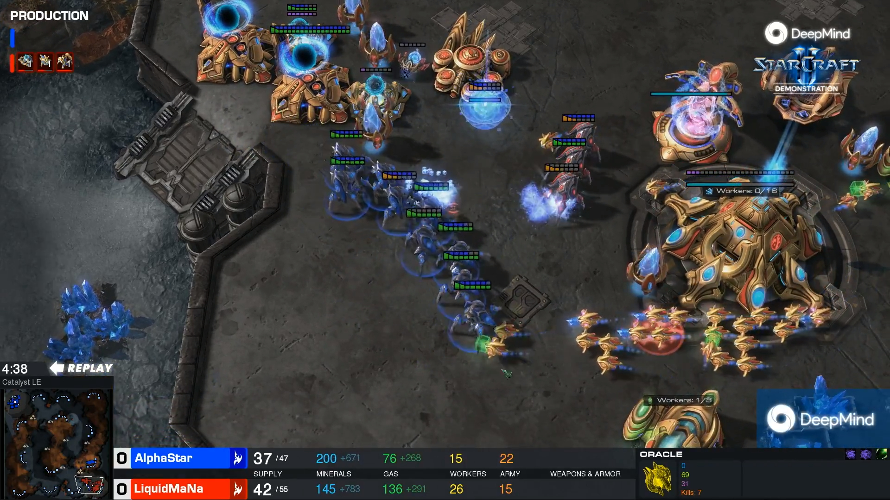

# Jugando a Starcraft II con Inteligencia Artificial

Mediante este repositorio se describe como instalar y dar los primeros pasos para construir un agente inteligente que sea capaz de jugar al videojuego Starcraft II mediante la utilización comportamientos automáticos. Starcraft II es un videojuego de estrategia en tiempo real cuyo objetivo es controlar todos los aspectos una de las tres posibles razas (terrans, protos y zergs) con el objetivo de derrotar a todos los openente en un mapa de juego. 

En este repositorio se describen ciertos aspectos fundamentales de como utilizar los diferentes recursos que hay disponibles para construir un jugador automático:

* Tutorial 1: [Instalación del entorno](./tutoriales/instalacion.md)
* Tutorial 2: [Creación del jugador](./tutoriales/players.md)
* Tutorial 3: [Recogiendo información del entorno](./tutoriales/information.md)

## Requisitos mínimos

A continuación se describen los requisitos mínimos para poder jugar con Starcraft. 

* Sistema operativo: Mac o Windows. Es posible utilizar Linux pero la interfaz gráfica puede no funcionar por lo que no podríamos ver como está funcionando nuestro jugador. 
* Memoría Ram: 8 Gbs de memoria ram.
* Espacio: 30 Gigas de espacio para la instalación de StarCraft. 
* Conexión a internet.

## Recursos de interés

- [Python](https://www.python.org/) como lenguaje de programación para el desarrollo de nuestros ejercicios.
- [TensorFlow](https://www.tensorflow.org/) como framework para el desarrollo de redes de neuronas convolucionales.
- [Tutoriales sobre tensorFlow](https://www.tensorflow.org/tutorials) si quieres aprender más sobre TensorFlow.
- [Keras](https://keras.io/) como framework para el desarrollo de redes de neuronas convolucionales.
- [TensorFlow Board](https://www.tensorflow.org/tensorboard) como sistema de visualización para ver la evolución de nuestro procesos de entrenamiento y sus resultados.
