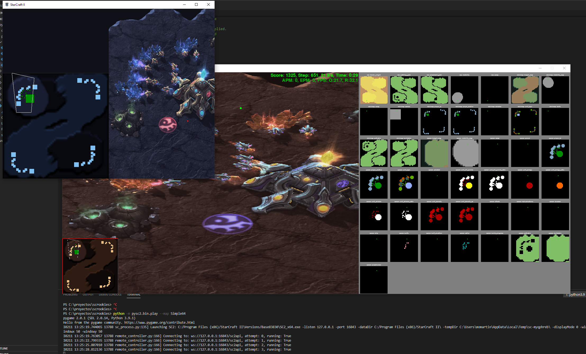

# Instalación de Starcraft II

Antes de comenzar a crear nuestro jugadores es necesario instalar StarCraft II y los diferentes conectores necesarios para la realización de nuestro agentes. 

**Paso 1: Instalación de StarCraft II**

Para poder ejecutar nuestro agentes necesitamos una versión completa de StarCraft II cuya versión mínima es la 3.16.1. Podremos ejecutar nuestro jugador de StarCraft en cualquier Sistema Operativo, pero mi recomendación es utilizarlo en Mac o Windows. 

***Instalación en Linux***

Es posible instalar StarCraft en Linux. Para ello se recomienda utilizar la documentación de instalación definida por Blizzard, que se puede encontrar en la siguiente link. Además de seguir las instrucciones es importante realizar dos acciones:

* El directorio donde se debe encontrar el juego es en la carpeta ~/StarCraftII/, donde ~ se corresponde con el directorio home de tu usuario en Linux. 
* En caso de utilizar otro directorio es necesario modificar el valor de la variable de entorno SC2PATH que indica la localización del videojuego. 

***Instalación en Windows/MacOS***

La instalación recomendada es en Windows/MacOs. Por lo que es posible instalar el videojuego desde Battle.net, registrandote previamente con tu cuenta de Gmail. Se recomienda no modificar la ruta de instalación del videojuego y en caso de hacerlo debemos modificar el valor de la variable de entorno SC2PATH. 

**Paso 2: Instalación de Python**

Para poder construir nuestro agentes es necesario instalar python en nuestros ordenadores. Se recomienda instalar python 3.6 o superior. A continuación se incluyen los enlaces para instalar python en cualquiera de los tres sistemas operativos sobre los que podemos jugar:

* [Instalación de python en Windows](https://www.python.org/downloads/windows/)
* [Instalación de python en Linux](https://www.python.org/downloads/source/)
* [Instalación de python en Mac](https://www.python.org/downloads/mac-osx/)

Una vez que hayais instalado python comprobar que la versión que teneis instalada es la correcta, para ellos podeis escribir en un terminal o cmd el siguiente comando:

```
$ python --version
```

y tendreis que obtener un texto en el que se os indique la versión de Python --> Python 3.9.1

**Paso 3: Instalación del conector de Starcraft II**

Una ve que hemos descargado nuestro juego y hayamos jugado un par de partidas con el objetivo de entender el funcionamiento básicos del juego y de los diferentes elementos a controlar. Es necesario instalar el software desarrollado por DeepMind para la interacción entre el agente y el juego. Para ello teneis que ejecutar el siguiente comando:

```
$ git clone https://github.com/deepmind/pysc2.git
```

y una vez que se haya descargado el código tendremos una carpeta denominada pysc2 donde estará todo lo necesario para poder crear nuestros jugadores. Pero antes es necesario instalarlo mediante el siguiente comando:

```
$ pip install --upgrade pysc2/
```

**Paso 4: Descargando los mapas**

Una vez que hemos realizado la instalación debemos descargar los mapas sobre los que queremos jugar. Para ello deberemos seleccionar un conjunto de los mapas que están disponibles en el siguiente [link](https://github.com/Blizzard/s2client-proto#downloads) en la sección de Map Packs. 

__NOTA: Es necesario descargar los mapas básicos de [Mele](http://blzdistsc2-a.akamaihd.net/MapPacks/Melee.zip) que son los que usaremos a lo largo de todos los tutoriales de este repositorio.__

Una vez que hemos descargado los mapas tenemos que descomprimir cada uno de los archivos en la carpeta Maps dentro del directorio de instalación del juego que estará:

* Windows: C:\Program Files (x86)\StarCraft II\
* Mac: /Applications/StarCraft II/
* Linux: /home/mi_nombre_de_usuario/StarCraftII

Si accedemos a cualquiera de estos directorios nos deberiamos encontrar la siguiente estructura:

* StarCraft II/
    Battle.net/
    Maps/
    Replays/
    SC2Data/
    Versions/

__NOTA: No cambiar el nombre de ninguna carpeta o el juego o el sistema de comuniaciones no funcionará correctamente.__

**Paso 5: Descargando los mapas**

Si todo ha ido bien deberiamos poder comprobar que todo ha funcionado correctamente mediante el siguiente comando:

```
$ python -m pysc2.bin.play --map Simple64
```

que iniciará nuestro sistema de juego como se puede ver en la siguiente imagen:



